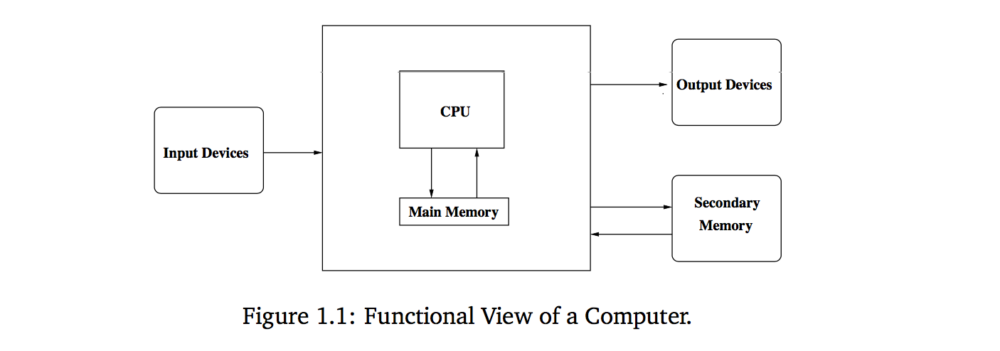

# :computer: Computers, Hardware, Software

You don’t have to know all the computer science concepts or all the details of how a computer works to be a successful programmer, but understanding the underlying principles will help you master the steps we go through to put our programs into action. Let's take a moment to understand 3 very important computer science concepts: Computers, Software and Hardware.

## Computers

Almost everyone has used a computer at one time or another. Perhaps you have played computer games or used a computer to write a paper or check your social media networks. Computers are used to predict the weather, design airplanes, make movies, run businesses, perform financial transactions, and control factories.

Have you ever stopped to wonder what exactly a computer is? How can one device perform so many different tasks? These basic questions are the starting point for learning about computers and computer programming.

A modern computer can be defined as **“a machine that stores and manipulates information under the control of a changeable program.”** There are two key elements to this definition. The first is that computers are devices for manipulating information. This means we can put information into a computer, and it can transform the information into new, useful forms, and then output or display the information for our interpretation.

Computers are not the only machines that manipulate information. When you use a simple calculator to add up a column of numbers, you are entering information (the numbers) and the calculator is processing the information to compute a running sum which is then displayed.

Every computer is just a machine for executing (carrying out) programs. There are many different kinds of computers. You might be familiar with Macintoshes and PCs, but there are literally thousands of other kinds of computers both real and theoretical. One of the remarkable discoveries of computer science is the realization that all of these different computers have the same power; with suitable programming, each computer can basically do all the things that any other computer can do. In this sense, the PC that you might have sitting on your desk is really a universal machine. It can do anything you want it to do, provided you can describe the task to be accomplished in sufficient detail. Now that's a computer!

## Hardware

As we mentioned previously is not necessary to know all the details of how a computer works, but it is important to understand the basics. It’s a bit like driving a car. Knowing a little about internal combustion engines helps to explain why you have to do things like fill the gas tank, start the engine, step on the accelerator, etc. You could learn to drive by just memorizing what to do, but a little more knowledge makes the whole process much more understandable.

Different computers can vary significantly in specific details, at a higher level all modern digital computers are remarkably similar.

Figure 1.1 shows a functional view of a computer. The central processing unit (CPU) is the “brain” of the machine. This is where all the basic operations of the computer are carried out. The CPU can perform simple arithmetic operations like adding two numbers and can also do logical operations like testing to see if two numbers are equal.

The memory stores programs and data. The CPU can only directly access information that is stored in main memory (called RAM for Random Access Memory). Main memory is fast, but it is also volatile. That is, when the power is turned off, the information in the memory is lost. Thus, there must also be some secondary memory that provides more permanent storage. In a modern personal computer, this is usually some sort of magnetic medium such as a hard disk (also called a hard drive). Optical media such as CD (compact disc) and DVD (digital versatile disc) and flash memory devices such as USB memory “sticks” are also common.

Humans interact with the computer through input and output devices. You are probably familiar with common devices such as a keyboard, mouse, and monitor (video screen). Information from input devices is processed by the CPU and may be shuffled off to the main or secondary memory. Similarly, when information needs to be displayed, the CPU sends it to one or more output devices. So what happens when you fire up your favorite game or word processing program? First, the instructions that comprise the program are copied from the (more) permanent secondary memory into the main memory of the computer. Once the instructions are loaded, the CPU starts executing the program.

Technically the CPU follows a process called the fetch-execute cycle. The first instruction is
retrieved from memory, decoded to figure out what it represents, and the appropriate action carried out. Then the next instruction is fetched, decoded and executed. The cycle continues, instruction after instruction. This is really all the computer does from the time that you turn it on until you turn it off again: fetch, decode, execute. It doesn't seem very exciting, does it? But the computer can execute this stream of simple instructions with blazing speed, zipping through millions of instructions each second. Put enough simple instructions together in just the right way, and the computer does amazing things.

## Software

Software rules the hardware (the physical machine).  It is the software that determines what any computer can do.  Sometimes abbreviated as SW and S/W, software is a collection of instructions that enable the user to interact with a computer, its hardware, or perform tasks. Without software, most computers would be useless. For example, without your Internet browser software, you could not surf the Internet or read this page and without an operating system, the browser could not run on your computer.

As a definition, software consists of carefully-organized instructions and code written by programmers in any of various special computer languages. Software is divided commonly into two main categories: (1) System software: controls the basic functions of a computer and comes usually preinstalled with the machine and (2) Application software: handles multitudes of common and specialized tasks a user wants to perform, such as accounting, communicating, data processing, word processing.

## What are the differences between hardware and software?

Computer hardware is any physical device used in or with your machine, whereas software is a collection of code installed onto your computer's hard drive. For example, the computer monitor you are using to read this text and the mouse you are using to navigate this web page is computer hardware. The Internet browser that allowed you to visit this page and the operating system that the browser is running on is considered software.

## References

* [Michigan Tech - What is Computer Science?](https://www.cs.mtu.edu/~john/whatiscs.html)
* [Computer hope - Software definition](https://www.computerhope.com/jargon/s/software.htm)
* [Python Programming: An Introduction to Computer Science](https://www.amazon.com/Python-Programming-Introduction-Computer-Science/dp/1590282418/ref=sr_1_fkmr0_2?ie=UTF8&qid=1489519089&sr=8-2-fkmr0&keywords=an+introduction+to+computer+science+phyton)
* [What is Software?](http://www.businessdictionary.com/definition/software.html)
* [Computer hope - What are the differences between hardware and software?](https://www.computerhope.com/issues/ch000039.htm)
